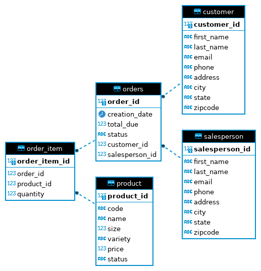

# JDBC App

## Introduction
The Core Java JDBC app involved learning and experimenting with the JDBC API by creating a basic 
Java application that would perform CRUD (CREATE, READ, UPDATE, and DELETE) operations on an 
existing dataset within a database. To implement the application, I inserted a data set into a 
PostgresSQL database deployed within a Docker container and used Git/GitHub to manage the codebase. 
I then used the java.sql package from the JDBC API with a JDBC driver to create a connection to the 
database and execute statements that perform CRUD operations. I used Maven to manage the project 
and install the dependencies, like the SLF4J logger that displays the output messages and the JDBC 
driver that acts as a layer between the application's JDBC methods and the database. To test 
whether the application had performed the CRUD operations, I verified if the data was within the 
database using the terminal psql command to query the database.

# Implementation
## ER Diagram

## Design Patterns
The design pattern I used for this project is the Data Access Object (DAO) pattern. The DAO pattern 
consists of a Data Transfer Object (DTO) and Data Access Object (DAO), and the DAO pattern is 
beneficial when the data within a database is normalized (3NF or higher) since joins will become 
simpler resulting in fewer database resources used which is good because the DAO pattern is 
vertically scalable. The DTO class represents a single record returned from a query or a table as 
an object. The DAO is a class or interface that acts as an abstraction layer, meaning the focus 
isn't on how it implements the CRUD operations; instead, the app focuses on what the business logic 
does with the DTO.

The repository pattern is another design pattern that focuses on CRUD operations involving only 
single tables, unlike the DAO pattern that could have multiple table fields within the DTO through 
database joins (My application mainly focused on working only with the customer table). Joining 
tables with the repository pattern is done within the code rather than the database processing the 
join. The benefits of the repository pattern are that it is horizontally scalable and allows for 
distribution where different databases can store the customer data and order data that joins 
within the code.

# Test

I manually tested the application by querying the PostgresSQL database within a terminal to confirm 
whether data from the application had been created, updated, or deleted the data. When reading from 
the database, I used the SLF4J logger to display the DTOs returned. The PostgresSQL database was set 
up and deployed within a docker container using the docker run command with the Postgres base image 
from Docker Hub. I initialized the test data and database objects (tables) by giving SQL files when 
using the terminal psql command with the option -f.